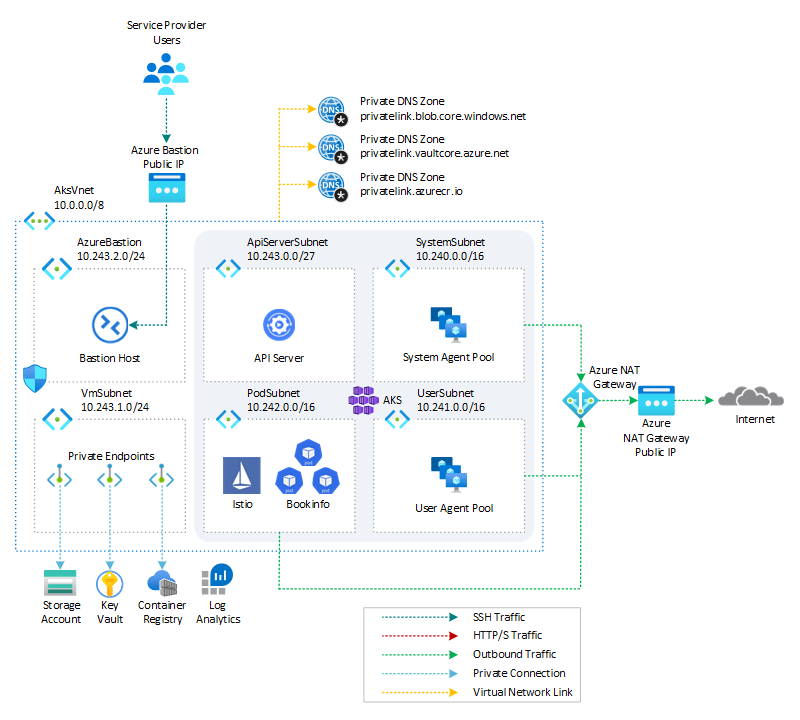
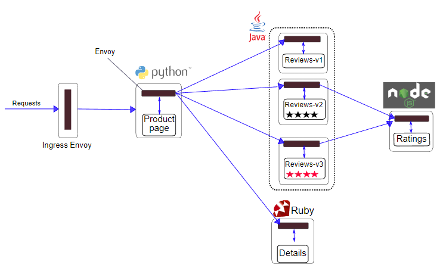
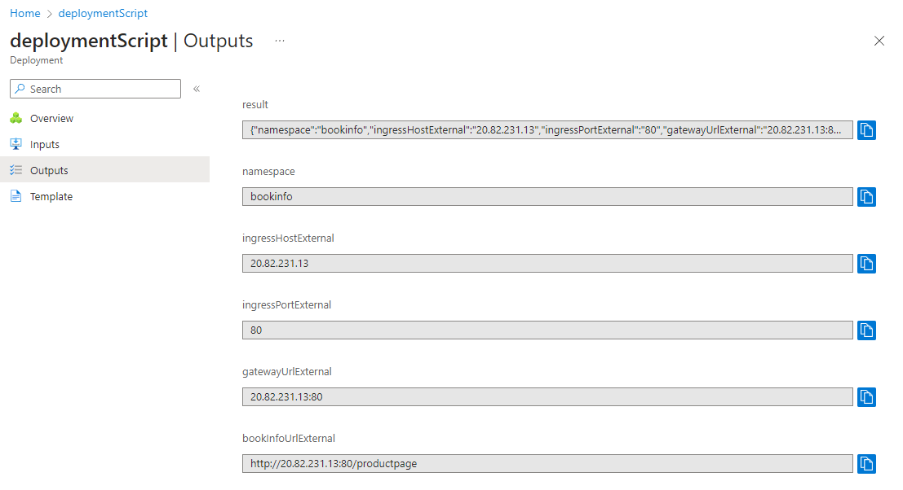
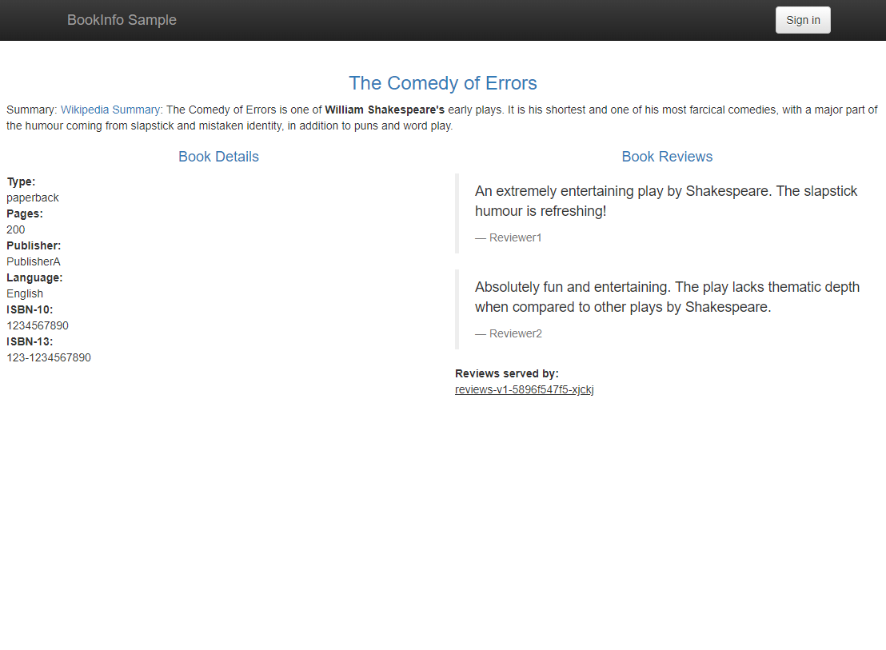

# How to install an AKS cluster with the Istio service mesh add-on via Bicep

[Istio](https://istio.io/latest/) addresses the challenges developers and operators face with a distributed or microservices architecture. The Istio-based service mesh add-on provides an officially supported and tested integration for Azure Kubernetes Service (AKS).

This article shows how to create an [Azure Kubernetes Service(AKS)](https://docs.microsoft.com/en-us/azure/aks/intro-kubernetes) cluster with the [Istio Service Mesh add-on](https://learn.microsoft.com/en-us/azure/aks/istio-deploy-addon) via [Bicep](https://docs.microsoft.com/en-us/azure/azure-resource-manager/bicep/overview) and deploy the [bookinfo](https://istio.io/latest/docs/examples/bookinfo/) sample application via a [Deployment Script](https://learn.microsoft.com/en-us/azure/azure-resource-manager/bicep/deployment-script-bicep).

For more information, see the following articles:

- [What is Istio?](https://istio.io/v1.1/docs/concepts/what-is-istio/)
- [Istio-based service mesh add-on for Azure Kubernetes Service](https://learn.microsoft.com/en-us/azure/aks/istio-about)
- [Deploy Istio-based service mesh add-on for Azure Kubernetes Service](https://learn.microsoft.com/en-us/azure/aks/istio-deploy-addon)
- [Deploy external or internal ingresses for Istio service mesh add-on for Azure Kubernetes Service](https://learn.microsoft.com/en-us/azure/aks/istio-deploy-ingress)
- [Testing the Istio-based Service Mesh add-on for Azure Kubernetes Service](https://medium.com/microsoftazure/testing-the-istio-based-service-mesh-add-on-for-azure-kubernetes-service-47d9be3fec0f)

## Prerequisites

- An active [Azure subscription](https://docs.microsoft.com/en-us/azure/guides/developer/azure-developer-guide#understanding-accounts-subscriptions-and-billing). If you don't have one, create a [free Azure account](https://azure.microsoft.com/free/) before you begin.
- [Visual Studio Code](https://code.visualstudio.com/) installed on one of the [supported platforms](https://code.visualstudio.com/docs/supporting/requirements#_platforms) along with the [Bicep extension](https://marketplace.visualstudio.com/items?itemName=ms-azuretools.vscode-bicep).
- Azure CLI version 2.44.0 or later installed. To install or upgrade, see [Install Azure CLI](https://learn.microsoft.com/en-us/cli/azure/install-azure-cli).
- `aks-preview` Azure CLI extension of version 0.5.133 or later installed

You can run `az --version` to verify above versions.

To install the aks-preview extension, run the following command:

```bash
az extension add --name aks-preview
```

Run the following command to update to the latest version of the extension released:

```bash
az extension update --name aks-preview
```

## Architecture

This sample provides a set of Bicep modules to deploy an [Azure Kubernetes Service(AKS)](https://docs.microsoft.com/en-us/azure/aks/intro-kubernetes) cluster with the [Istio Service Mesh add-on](https://learn.microsoft.com/en-us/azure/aks/istio-deploy-addon) via [Bicep](https://docs.microsoft.com/en-us/azure/azure-resource-manager/bicep/overview). A [Deployment Script](https://learn.microsoft.com/en-us/azure/azure-resource-manager/bicep/deployment-script-bicep) is used to deploy the [bookinfo](https://istio.io/latest/docs/examples/bookinfo/) sample application. The following diagram shows the architecture and network topology deployed by the sample:



Bicep modules are parametric, so you can choose any network plugin:

- [Azure CNI with static IP allocation](https://learn.microsoft.com/en-us/azure/aks/configure-azure-cni)
- [Azure CNI with dynamic IP allocation](https://learn.microsoft.com/en-us/azure/aks/configure-azure-cni-dynamic-ip-allocation)
- [Azure CNI Powered by Cilium](https://learn.microsoft.com/en-us/azure/aks/azure-cni-powered-by-cilium)
- [Azure CNI Overlay](https://learn.microsoft.com/en-us/azure/aks/azure-cni-overlay)
- [BYO CNI](https://learn.microsoft.com/en-us/azure/aks/use-byo-cni?tabs=azure-cli)
- [Kubenet](https://learn.microsoft.com/en-us/azure/aks/configure-kubenet)

The Bicep modules also allow installing the following extensions and add-ons for [Azure Kubernetes Service(AKS)](https://docs.microsoft.com/en-us/azure/aks/intro-kubernetes):

In addition, this sample shows how to deploy an [Azure Kubernetes Service](https://docs.microsoft.com/en-us/azure/aks/intro-kubernetes) cluster with the following features:

- [API Server VNET Integration](https://learn.microsoft.com/en-us/azure/aks/api-server-vnet-integration) allows you to enable network communication between the API server and the cluster nodes without requiring a private link or tunnel. AKS clusters with API Server VNET integration provide a series of advantages, for example, they can have public network access or private cluster mode enabled or disabled without redeploying the cluster. For more information, see [Create an Azure Kubernetes Service cluster with API Server VNet Integration](https://learn.microsoft.com/en-us/azure/aks/api-server-vnet-integration).
- [Azure NAT Gateway](https://learn.microsoft.com/en-us/azure/virtual-network/nat-gateway/nat-overview) to manage outbound connections initiated by AKS-hosted workloads.
- [Event-driven Autoscaling (KEDA) add-on](https://learn.microsoft.com/en-us/azure/aks/keda-about) is a single-purpose and lightweight component that strives to make application autoscaling simple and is a CNCF Incubation project.
- [Dapr extension for Azure Kubernetes Service (AKS)](https://learn.microsoft.com/en-us/azure/aks/dapr) allows you to install [Dapr](https://dapr.io/), a portable, event-driven runtime that simplifies building resilient, stateless, and stateful applications that run on the cloud and edge and embrace the diversity of languages and developer frameworks. With its sidecar architecture, Dapr helps you tackle the challenges that come with building microservices and keeps your code platform agnostic.
- [Flux V2 extension](https://learn.microsoft.com/en-us/azure/azure-arc/kubernetes/tutorial-use-gitops-flux2?tabs=azure-cli) allows to deploy workloads to an Azure Kubernetes Service (AKS) cluster via [GitOps](https://www.weave.works/technologies/gitops/). For more information, see [GitOps Flux v2 configurations with AKS and Azure Arc-enabled Kubernetes](https://learn.microsoft.com/en-us/azure/azure-arc/kubernetes/conceptual-gitops-flux2)
- [Vertical Pod Autoscaling](https://learn.microsoft.com/en-us/azure/aks/vertical-pod-autoscaler) allows you to automatically sets resource requests and limits on containers per workload based on past usage. VPA makes certain pods are scheduled onto nodes that have the required CPU and memory resources. For more information, see [Kubernetes Vertical Pod Autoscaling](https://itnext.io/k8s-vertical-pod-autoscaling-fd9e602cbf81).
- [Azure Key Vault Provider for Secrets Store CSI Driver](https://learn.microsoft.com/en-us/azure/aks/csi-secrets-store-identity-access) provides a variety of methods of identity-based access to your [Azure Key Vault](https://learn.microsoft.com/en-us/azure/key-vault/general/overview).
- [Image Cleaner](https://learn.microsoft.com/en-us/azure/aks/image-cleaner?tabs=azure-cli) to clean up stale images on your Azure Kubernetes Service cluster.
- [Open Service Mesh add-on](https://learn.microsoft.com/en-us/azure/aks/open-service-mesh-about) is a lightweight, extensible, cloud native service mesh that allows you to uniformly manage, secure, and get out-of-the-box observability features for highly dynamic microservice environments. The Bicep modules allows to install Open Service Mesh add-on as an alternative to the Istio Service Mesh add-on. **NOTE**: you can't install both the Open Service Mesh add-on and Istio Service Mesh add-on on the same AKS cluster.

In a production environment, we strongly recommend deploying a [private AKS cluster](https://docs.microsoft.com/en-us/azure/aks/private-clusters) with [Uptime SLA](https://docs.microsoft.com/en-us/azure/aks/uptime-sla). For more information, see [private AKS cluster with a Public DNS address](https://docs.microsoft.com/en-us/azure/aks/private-clusters#create-a-private-aks-cluster-with-a-public-dns-address). Alternatively, you can deploy a public AKS cluster and secure access to the API server using [authorized IP address ranges](https://learn.microsoft.com/en-us/azure/aks/api-server-authorized-ip-ranges).

The Bicep modules deploy the following Azure resources:

- [Microsoft.Network/applicationGateways](https://learn.microsoft.com/en-us/azure/templates/microsoft.network/applicationgateways?pivots=deployment-language-bicep): an [Azure Application Gateway](https://learn.microsoft.com/en-us/azure/application-gateway/overview) resource used to expose the AKS-hosted sample application via [Azure Private Link Service](https://learn.microsoft.com/en-us/azure/private-link/private-link-service-overview) and [Application Gateway Ingress Controller](https://learn.microsoft.com/en-us/azure/application-gateway/ingress-controller-overview). In this sample, the installation of the Application Gateway and WAF Policy is disabled, but you can turn it on in the parameters file.
- [Microsoft.Network/ApplicationGatewayWebApplicationFirewallPolicies](https://learn.microsoft.com/en-us/azure/templates/microsoft.network/applicationgatewaywebapplicationfirewallpolicies?pivots=deployment-language-bicep): [Azure Web Application Firewall (WAF)](https://learn.microsoft.com/en-us/azure/web-application-firewall/ag/ag-overview) on [Azure Application Gateway](https://learn.microsoft.com/en-us/azure/application-gateway/overview) provides centralized protection for your web applications. WAF defends your web services against common exploits and vulnerabilities. It keeps your service highly available for your users and helps you meet compliance requirements. In this sample, the installation of the Application Gateway and WAF Policy is disabled, but you can turn it on in the parameters file. The WAF policy deployed by this sample consists of three types of security rules:
  - [Custom rules](https://learn.microsoft.com/en-us/azure/web-application-firewall/ag/ag-overview#custom-rules) are used to block incoming requests based on the content of the payload, querystring, HTTP request method, IP address of the caller, and more. This sample add a couple of customer rules to block calls coming from a given IP range or calls that contain the word `blockme` in the querystring.
  - [OWASP](https://owasp.org/) [Core rule sets](https://learn.microsoft.com/en-us/azure/web-application-firewall/ag/ag-overview#core-rule-sets) provide an easy way to deploy protection against a common set of security threats like SQL injection or cross-site scripting.
  - [Bot protection rule set](https://learn.microsoft.com/en-us/azure/web-application-firewall/ag/ag-overview#bot-protection-rule-set) can be used to take custom actions on requests from known bot categories.
- [Microsoft.ContainerService/managedClusters](https://learn.microsoft.com/en-us/azure/templates/microsoft.containerservice/managedclusters?pivots=deployment-language-bicep): A public or private AKS cluster composed of a:
  - `system` node pool in a dedicated subnet. The default node pool hosts only critical system pods and services. The worker nodes have node taint which prevents application pods from beings scheduled on this node pool.
  - `user` node pool hosting user workloads and artifacts in a dedicated subnet.
- [Microsoft.Network/virtualNetworks](https://docs.microsoft.com/en-us/azure/templates/microsoft.network/virtualnetworks): a new virtual network with seven subnets:
  - `SystemSubnet`: a subnet used for the agent nodes of the `system` node pool.
  - `UserSubnet`: a subnet used for the agent nodes of the `user` node pool.
  - `PodSubnet`: a subnet used to allocate private IP addresses to pods dynamically.
  - `ApiServerSubnet`: API Server VNET Integration projects the API server endpoint directly into this delegated subnet in the virtual network where the AKS cluster is deployed.
  - `AzureBastionSubnet`: a subnet for the Azure Bastion Host.
  - `VmSubnet`: a subnet for a jump-box virtual machine used to connect to the (private) AKS cluster and for the private endpoints.
  - `AppGatewaySubnet`: a subnet hosting the Application Gateway.
- [Microsoft.ManagedIdentity/userAssignedIdentities](https://learn.microsoft.com/en-us/azure/templates/microsoft.managedidentity/2018-11-30/userassignedidentities?pivots=deployment-language-bicep): a user-defined managed identity used by the AKS cluster to create additional resources like load balancers and managed disks in Azure.
- [Microsoft.Compute/virtualMachines](https://docs.microsoft.com/en-us/azure/templates/microsoft.compute/virtualmachines): Bicep modules can optionally create a jump-box virtual machine to manage the private AKS cluster.
- [Microsoft.Network/bastionHosts](https://docs.microsoft.com/en-us/azure/templates/microsoft.network/bastionhosts): a separate Azure Bastion is deployed in the AKS cluster virtual network to provide SSH connectivity to both agent nodes and virtual machines.
- [Microsoft.Network/natGateways](https://learn.microsoft.com/en-us/azure/templates/microsoft.network/natgateways?pivots=deployment-language-bicep): a bring-your-own (BYO) [Azure NAT Gateway](https://learn.microsoft.com/en-us/azure/virtual-network/nat-gateway/nat-overview) to manage outbound connections initiated by AKS-hosted workloads. The NAT Gateway is associated to the `SystemSubnet`, `UserSubnet`, and `PodSubnet` subnets. The [outboundType](https://learn.microsoft.com/en-us/azure/aks/egress-outboundtype#outbound-type-of-managednatgateway-or-userassignednatgateway) property of the cluster is set to `userAssignedNatGateway` to specify that a BYO NAT Gateway is used for outbound connections. NOTE: you can update the `outboundType` after cluster creation and this will deploy or remove resources as required to put the cluster into the new egress configuration. For more information, see [Updating outboundType after cluster creation](https://learn.microsoft.com/en-us/azure/aks/egress-outboundtype#updating-outboundtype-after-cluster-creation-preview).
- [Microsoft.Storage/storageAccounts](https://docs.microsoft.com/en-us/azure/templates/microsoft.storage/storageaccounts): this storage account is used to store the boot diagnostics logs of both the service provider and service consumer virtual machines. Boot Diagnostics is a debugging feature that allows you to view console output and screenshots to diagnose virtual machine status.
- [Microsoft.ContainerRegistry/registries](https://learn.microsoft.com/en-us/azure/templates/microsoft.containerregistry/registries?pivots=deployment-language-bicep): an Azure Container Registry (ACR) to build, store, and manage container images and artifacts in a private registry for all container deployments.
- [Microsoft.KeyVault/vaults](https://learn.microsoft.com/en-us/azure/templates/microsoft.keyvault/vaults?pivots=deployment-language-bicep): an Azure Key Vault used to store secrets, certificates, and keys that can be mounted as files by pods using [Azure Key Vault Provider for Secrets Store CSI Driver](https://github.com/Azure/secrets-store-csi-driver-provider-azure). For more information, see [Use the Azure Key Vault Provider for Secrets Store CSI Driver in an AKS cluster](https://learn.microsoft.com/en-us/azure/aks/csi-secrets-store-driver) and [Provide an identity to access the Azure Key Vault Provider for Secrets Store CSI Driver](https://learn.microsoft.com/en-us/azure/aks/csi-secrets-store-identity-access).
- [Microsoft.Network/privateEndpoints](https://docs.microsoft.com/en-us/azure/templates/microsoft.network/privateendpoints): an [Azure Private Endpoints](https://docs.microsoft.com/en-us/azure/private-link/private-endpoint-overview) is created for each of the following resources:
  - Azure Container Registry
  - Azure Key Vault
  - Azure Storage Account
  - API Server when deploying a private AKS cluster.
- [Microsoft.Network/privateDnsZones](https://docs.microsoft.com/en-us/azure/templates/microsoft.network/privatednszones): an [Azure Private DNS Zone](https://docs.microsoft.com/en-us/azure/dns/private-dns-overview) is created for each of the following resources:
  - Azure Container Registry
  - Azure Key Vault
  - Azure Storage Account
  - API Server when deploying a private AKS cluster.
- [Microsoft.Network/networkSecurityGroups](https://docs.microsoft.com/en-us/azure/templates/microsoft.network/networksecuritygroups?tabs=bicep): subnets hosting virtual machines and Azure Bastion Hosts are protected by [Azure Network Security Groups](https://docs.microsoft.com/en-us/azure/virtual-network/network-security-groups-overview) that are used to filter inbound and outbound traffic.
- [Microsoft.OperationalInsights/workspaces](https://docs.microsoft.com/en-us/azure/templates/microsoft.operationalinsights/workspaces): a centralized [Azure Log Analytics](https://docs.microsoft.com/en-us/azure/azure-monitor/logs/log-analytics-workspace-overview) workspace is used to collect the diagnostics logs and metrics from all the Azure resources:
  - Azure Kubernetes Service cluster
  - Azure Key Vault
  - Azure Network Security Group
  - Azure Container Registry
  - Azure Storage Account
  - Azure jump-box virtual machine
- [Microsoft.Resources/deploymentScripts](https://learn.microsoft.com/en-us/azure/templates/microsoft.resources/deploymentscripts?pivots=deployment-language-bicep): a [Deployment Script](https://learn.microsoft.com/en-us/azure/azure-resource-manager/bicep/deployment-script-bicep) is used to deploy the [bookinfo](https://istio.io/latest/docs/examples/bookinfo/) sample application.

> **NOTE**  
> You can find the `architecture.vsdx` file used for the diagram under the `visio` folder.

## What is Bicep?

[Bicep](https://docs.microsoft.com/en-us/azure/azure-resource-manager/bicep/overview) is a domain-specific language (DSL) that uses a declarative syntax to deploy Azure resources. It provides concise syntax, reliable type safety, and support for code reuse. Bicep offers the best authoring experience for your infrastructure-as-code solutions in Azure.

## What is a Service Mesh?

Modern applications are typically architected as distributed collections of microservices, with each collection of microservices performing some discrete business function. A service mesh is a dedicated infrastructure layer that you can add to your applications. It allows you to transparently add capabilities like observability, traffic management, and security, without adding them to your own code. The term **service mesh** describes both the type of software you use to implement this pattern, and the security or network domain that is created when you use that software.

As the deployment of distributed services, such as in a Kubernetes-based system, grows in size and complexity, it can become harder to understand and manage. You may need to implement capabilities such as discovery, load balancing, failure recovery, metrics, and monitoring. A service mesh can also address more complex operational requirements like A/B testing, canary deployments, rate limiting, access control, encryption, and end-to-end authentication.

Service-to-service communication is what makes a distributed application possible. Routing this communication, both within and across application clusters, becomes increasingly complex as the number of services grow. Istio helps reduce this complexity while easing the strain on development teams.

## What is Istio?

[Istio](https://istio.io/v1.1/docs/concepts/what-is-istio/) is an open-source service mesh that layers transparently onto existing distributed applications. Istio’s powerful features provide a uniform and more efficient way to secure, connect, and monitor services. Istio enables load balancing, service-to-service authentication, and monitoring – with few or no service code changes. Its powerful control plane brings vital features, including:

- Secure service-to-service communication in a cluster with TLS encryption, strong identity-based authentication and authorization.
- Automatic load balancing for HTTP, gRPC, WebSocket, and TCP traffic.
- Fine-grained control of traffic behavior with rich routing rules, retries, failovers, and fault injection.
- A pluggable policy layer and configuration API supporting access controls, rate limits and quotas.
- Automatic metrics, logs, and traces for all traffic within a cluster, including cluster ingress and egress.

## How is the add-on different from open-source Istio?

This service mesh add-on uses and builds on top of open-source Istio. The add-on flavor provides the following extra benefits:

- Istio versions are tested and verified to be compatible with supported versions of Azure Kubernetes Service.
- Microsoft handles scaling and configuration of Istio control plane
- Microsoft adjusts scaling of AKS components like `coredns` when Istio is enabled.
- Microsoft provides managed lifecycle (upgrades) for Istio components when triggered by user.
- Verified external and internal ingress set-up.
- Verified to work with [Azure Monitor managed service for Prometheus](https://learn.microsoft.com/en-us/azure/azure-monitor/essentials/prometheus-metrics-overview) and [Azure Managed Grafana](https://learn.microsoft.com/en-us/azure/managed-grafana/overview).
- Official Azure support provided for the add-on.

## Limitations

Istio-based service mesh add-on for AKS has the following limitations:

- The add-on currently doesn't work on AKS clusters using [Azure CNI Powered by Cilium](https://learn.microsoft.com/en-us/azure/aks/azure-cni-powered-by-cilium).
- The add-on doesn't work on AKS clusters that are using [Open Service Mesh addon for AKS](https://learn.microsoft.com/en-us/azure/aks/open-service-mesh-about).
- The add-on doesn't work on AKS clusters that have Istio installed on them already outside the add-on installation.
- Managed lifecycle of mesh on how Istio versions are installed and later made available for upgrades.
- Istio doesn't support Windows Server containers.
- Customization of mesh based on the following custom resources is blocked for now - `EnvoyFilter, ProxyConfig, WorkloadEntry, WorkloadGroup, Telemetry, IstioOperator, WasmPlugin`

## Register the AzureServiceMeshPreview feature flag

Register the `AzureServiceMeshPreview` feature flag by using the [az feature register][az-feature-register] command:

```bash
az feature register --namespace "Microsoft.ContainerService" --name "AzureServiceMeshPreview"
```

It takes a few minutes for the feature to register. Verify the registration status by using the [az feature show][az-feature-show] command:

```bash
az feature show --namespace "Microsoft.ContainerService" --name "AzureServiceMeshPreview"
```

When the status reflects _Registered_, refresh the registration of the _Microsoft.ContainerService_ resource provider by using the [az provider register][az-provider-register] command:

```bash
az provider register --namespace Microsoft.ContainerService
```

## Deploy the Bicep modules

You can deploy the Bicep modules in the `bicep` folder using the `deploy.sh` Bash script in the same folder. Specify a value for the following parameters in the `deploy.sh` script and `main.parameters.json` parameters file before deploying the Bicep modules.

- `prefix`: specifies a prefix for all the Azure resources.
- `authenticationType`: specifies the type of authentication when accessing the Virtual Machine. `sshPublicKey` is the recommended value. Allowed values: `sshPublicKey` and `password`.
- `vmAdminUsername`: specifies the name of the administrator account of the virtual machine.
- `vmAdminPasswordOrKey`: specifies the SSH Key or password for the virtual machine.
- `aksClusterSshPublicKey`:  specifies the SSH Key or password for AKS cluster agent nodes.
- `aadProfileAdminGroupObjectIDs`: when deploying an AKS cluster with Azure AD and Azure RBAC integration, this array parameter contains the list of Azure AD group object IDs that will have the admin role of the cluster.
- `keyVaultObjectIds`: Specifies the object ID of the service principals to configure in Key Vault access policies.

We suggest reading sensitive configuration data such as passwords or SSH keys from a pre-existing Azure Key Vault resource. For more information, see [Use Azure Key Vault to pass secure parameter value during Bicep deployment](https://docs.microsoft.com/en-us/azure/azure-resource-manager/bicep/key-vault-parameter?tabs=azure-cli).

## AKS Cluster Bicep module

The following table contains the Bicep code used to deploy the [Azure Kubernetes Service(AKS)](https://docs.microsoft.com/en-us/azure/aks/intro-kubernetes) cluster.

```bicep
// Parameters
@description('Specifies the name of the AKS cluster.')
param name string = 'aks-${uniqueString(resourceGroup().id)}'

@description('Specifies whether to enable API server VNET integration for the cluster or not.')
param enableVnetIntegration bool = true

@description('Specifies the name of the existing virtual network.')
param virtualNetworkName string

@description('Specifies the name of the subnet hosting the worker nodes of the default system agent pool of the AKS cluster.')
param systemAgentPoolSubnetName string = 'SystemSubnet'

@description('Specifies the name of the subnet hosting the worker nodes of the user agent pool of the AKS cluster.')
param userAgentPoolSubnetName string = 'UserSubnet'

@description('Specifies the name of the subnet hosting the pods running in the AKS cluster.')
param podSubnetName string = 'PodSubnet'

@description('Specifies the name of the subnet delegated to the API server when configuring the AKS cluster to use API server VNET integration.')
param apiServerSubnetName string = 'ApiServerSubnet'

@description('Specifies the name of the AKS user-defined managed identity.')
param managedIdentityName string

@description('Specifies the DNS prefix specified when creating the managed cluster.')
param dnsPrefix string = name

@description('Specifies the network plugin used for building Kubernetes network. - azure or kubenet.')
@allowed([
  'azure'
  'kubenet'
])
param networkPlugin string = 'azure'

@description('Specifies the Network plugin mode used for building the Kubernetes network.')
@allowed([
  ''
  'Overlay'
])

param networkPluginMode string = ''

@description('Specifies the network policy used for building Kubernetes network. - calico or azure')
@allowed([
  'azure'
  'calico'
])
param networkPolicy string = 'azure'

@description('Specifies the CIDR notation IP range from which to assign pod IPs when kubenet is used.')
param podCidr string = '192.168.0.0/16'

@description('A CIDR notation IP range from which to assign service cluster IPs. It must not overlap with any Subnet IP ranges.')
param serviceCidr string = '172.16.0.0/16'

@description('Specifies the IP address assigned to the Kubernetes DNS service. It must be within the Kubernetes service address range specified in serviceCidr.')
param dnsServiceIP string = '172.16.0.10'

@description('Specifies the CIDR notation IP range assigned to the Docker bridge network. It must not overlap with any Subnet IP ranges or the Kubernetes service address range.')
param dockerBridgeCidr string = '172.17.0.1/16'

@description('Specifies the sku of the load balancer used by the virtual machine scale sets used by nodepools.')
@allowed([
  'basic'
  'standard'
])
param loadBalancerSku string = 'standard'

@description('Specifies outbound (egress) routing method. - loadBalancer or userDefinedRouting.')
@allowed([
  'loadBalancer'
  'managedNATGateway'
  'userAssignedNATGateway'
  'userDefinedRouting'
])
param outboundType string = 'loadBalancer'

@description('Specifies the tier of a managed cluster SKU: Paid or Free')
@allowed([
  'Standard'
  'Free'
])
param skuTier string = 'Standard'

@description('Specifies the version of Kubernetes specified when creating the managed cluster.')
param kubernetesVersion string = '1.18.8'

@description('Specifies the administrator username of Linux virtual machines.')
param adminUsername string = 'azureuser'

@description('Specifies the SSH RSA public key string for the Linux nodes.')
param sshPublicKey string

@description('Specifies the tenant id of the Azure Active Directory used by the AKS cluster for authentication.')
param aadProfileTenantId string = subscription().tenantId

@description('Specifies the AAD group object IDs that will have admin role of the cluster.')
param aadProfileAdminGroupObjectIDs array = []

@description('Specifies the upgrade channel for auto upgrade. Allowed values include rapid, stable, patch, node-image, none.')
@allowed([
  'rapid'
  'stable'
  'patch'
  'node-image'
  'none'
])
param upgradeChannel string = 'stable'

@description('Specifies whether to create the cluster as a private cluster or not.')
param enablePrivateCluster bool = true

@description('Specifies the Private DNS Zone mode for private cluster. When the value is equal to None, a Public DNS Zone is used in place of a Private DNS Zone')
param privateDNSZone string = 'none'

@description('Specifies whether to create additional public FQDN for private cluster or not.')
param enablePrivateClusterPublicFQDN bool = true

@description('Specifies whether to enable managed AAD integration.')
param aadProfileManaged bool = true

@description('Specifies whether to  to enable Azure RBAC for Kubernetes authorization.')
param aadProfileEnableAzureRBAC bool = true

@description('Specifies the unique name of of the system node pool profile in the context of the subscription and resource group.')
param systemAgentPoolName string = 'nodepool1'

@description('Specifies the vm size of nodes in the system node pool.')
param systemAgentPoolVmSize string = 'Standard_DS5_v2'

@description('Specifies the OS Disk Size in GB to be used to specify the disk size for every machine in the system agent pool. If you specify 0, it will apply the default osDisk size according to the vmSize specified.')
param systemAgentPoolOsDiskSizeGB int = 100

@description('Specifies the OS disk type to be used for machines in a given agent pool. Allowed values are \'Ephemeral\' and \'Managed\'. If unspecified, defaults to \'Ephemeral\' when the VM supports ephemeral OS and has a cache disk larger than the requested OSDiskSizeGB. Otherwise, defaults to \'Managed\'. May not be changed after creation. - Managed or Ephemeral')
@allowed([
  'Ephemeral'
  'Managed'
])
param systemAgentPoolOsDiskType string = 'Ephemeral'

@description('Specifies the number of agents (VMs) to host docker containers in the system node pool. Allowed values must be in the range of 1 to 100 (inclusive). The default value is 1.')
param systemAgentPoolAgentCount int = 3

@description('Specifies the OS type for the vms in the system node pool. Choose from Linux and Windows. Default to Linux.')
@allowed([
  'Linux'
  'Windows'
])
param systemAgentPoolOsType string = 'Linux'

@description('Specifies the maximum number of pods that can run on a node in the system node pool. The maximum number of pods per node in an AKS cluster is 250. The default maximum number of pods per node varies between kubenet and Azure CNI networking, and the method of cluster deployment.')
param systemAgentPoolMaxPods int = 30

@description('Specifies the maximum number of nodes for auto-scaling for the system node pool.')
param systemAgentPoolMaxCount int = 5

@description('Specifies the minimum number of nodes for auto-scaling for the system node pool.')
param systemAgentPoolMinCount int = 3

@description('Specifies whether to enable auto-scaling for the system node pool.')
param systemAgentPoolEnableAutoScaling bool = true

@description('Specifies the virtual machine scale set priority in the system node pool: Spot or Regular.')
@allowed([
  'Spot'
  'Regular'
])
param systemAgentPoolScaleSetPriority string = 'Regular'

@description('Specifies the ScaleSetEvictionPolicy to be used to specify eviction policy for spot virtual machine scale set. Default to Delete. Allowed values are Delete or Deallocate.')
@allowed([
  'Delete'
  'Deallocate'
])
param systemAgentPoolScaleSetEvictionPolicy string = 'Delete'

@description('Specifies the Agent pool node labels to be persisted across all nodes in the system node pool.')
param systemAgentPoolNodeLabels object = {}

@description('Specifies the taints added to new nodes during node pool create and scale. For example, key=value:NoSchedule.')
param systemAgentPoolNodeTaints array = []

@description('Determines the placement of emptyDir volumes, container runtime data root, and Kubelet ephemeral storage.')
@allowed([
  'OS'
  'Temporary'
])
param systemAgentPoolKubeletDiskType string = 'OS'

@description('Specifies the type for the system node pool: VirtualMachineScaleSets or AvailabilitySet')
@allowed([
  'VirtualMachineScaleSets'
  'AvailabilitySet'
])
param systemAgentPoolType string = 'VirtualMachineScaleSets'

@description('Specifies the availability zones for the agent nodes in the system node pool. Requirese the use of VirtualMachineScaleSets as node pool type.')
param systemAgentPoolAvailabilityZones array = [
  '1'
  '2'
  '3'
]

@description('Specifies the unique name of of the user node pool profile in the context of the subscription and resource group.')
param userAgentPoolName string = 'nodepool1'

@description('Specifies the vm size of nodes in the user node pool.')
param userAgentPoolVmSize string = 'Standard_DS5_v2'

@description('Specifies the OS Disk Size in GB to be used to specify the disk size for every machine in the system agent pool. If you specify 0, it will apply the default osDisk size according to the vmSize specified..')
param userAgentPoolOsDiskSizeGB int = 100

@description('Specifies the OS disk type to be used for machines in a given agent pool. Allowed values are \'Ephemeral\' and \'Managed\'. If unspecified, defaults to \'Ephemeral\' when the VM supports ephemeral OS and has a cache disk larger than the requested OSDiskSizeGB. Otherwise, defaults to \'Managed\'. May not be changed after creation. - Managed or Ephemeral')
@allowed([
  'Ephemeral'
  'Managed'
])
param userAgentPoolOsDiskType string = 'Ephemeral'

@description('Specifies the number of agents (VMs) to host docker containers in the user node pool. Allowed values must be in the range of 1 to 100 (inclusive). The default value is 1.')
param userAgentPoolAgentCount int = 3

@description('Specifies the OS type for the vms in the user node pool. Choose from Linux and Windows. Default to Linux.')
@allowed([
  'Linux'
  'Windows'
])
param userAgentPoolOsType string = 'Linux'

@description('Specifies the maximum number of pods that can run on a node in the user node pool. The maximum number of pods per node in an AKS cluster is 250. The default maximum number of pods per node varies between kubenet and Azure CNI networking, and the method of cluster deployment.')
param userAgentPoolMaxPods int = 30

@description('Specifies the maximum number of nodes for auto-scaling for the user node pool.')
param userAgentPoolMaxCount int = 5

@description('Specifies the minimum number of nodes for auto-scaling for the user node pool.')
param userAgentPoolMinCount int = 3

@description('Specifies whether to enable auto-scaling for the user node pool.')
param userAgentPoolEnableAutoScaling bool = true

@description('Specifies the virtual machine scale set priority in the user node pool: Spot or Regular.')
@allowed([
  'Spot'
  'Regular'
])
param userAgentPoolScaleSetPriority string = 'Regular'

@description('Specifies the ScaleSetEvictionPolicy to be used to specify eviction policy for spot virtual machine scale set. Default to Delete. Allowed values are Delete or Deallocate.')
@allowed([
  'Delete'
  'Deallocate'
])
param userAgentPoolScaleSetEvictionPolicy string = 'Delete'

@description('Specifies the Agent pool node labels to be persisted across all nodes in the user node pool.')
param userAgentPoolNodeLabels object = {}

@description('Specifies the taints added to new nodes during node pool create and scale. For example, key=value:NoSchedule.')
@allowed([
  'OS'
  'Temporary'
])
param userAgentPoolNodeTaints array = []

@description('Determines the placement of emptyDir volumes, container runtime data root, and Kubelet ephemeral storage.')
param userAgentPoolKubeletDiskType string = 'OS'

@description('Specifies the type for the user node pool: VirtualMachineScaleSets or AvailabilitySet')
@allowed([
  'VirtualMachineScaleSets'
  'AvailabilitySet'
])
param userAgentPoolType string = 'VirtualMachineScaleSets'

@description('Specifies the availability zones for the agent nodes in the user node pool. Requirese the use of VirtualMachineScaleSets as node pool type.')
param userAgentPoolAvailabilityZones array = [
  '1'
  '2'
  '3'
]

@description('Specifies whether the httpApplicationRouting add-on is enabled or not.')
param httpApplicationRoutingEnabled bool = false

@description('Specifies whether the Open Service Mesh add-on is enabled or not.')
param openServiceMeshEnabled bool = false

@description('Specifies whether the Istio Service Mesh add-on is enabled or not.')
param istioServiceMeshEnabled bool = false

@description('Specifies whether the Istio Ingress Gateway is enabled or not.')
param istioIngressGatewayEnabled bool = false

@description('Specifies the type of the Istio Ingress Gateway.')
@allowed([
  'Internal'
  'External'
])
param istioIngressGatewayType string = 'External'

@description('Specifies whether the Kubernetes Event-Driven Autoscaler (KEDA) add-on is enabled or not.')
param kedaEnabled bool = false

@description('Specifies whether the Dapr extension is enabled or not.')
param daprEnabled bool = false

@description('Enable high availability (HA) mode for the Dapr control plane')
param daprHaEnabled bool = false

@description('Specifies whether the Flux V2 extension is enabled or not.')
param fluxGitOpsEnabled bool = false

@description('Specifies whether the Vertical Pod Autoscaler is enabled or not.')
param verticalPodAutoscalerEnabled bool = false

@description('Specifies whether the aciConnectorLinux add-on is enabled or not.')
param aciConnectorLinuxEnabled bool = false

@description('Specifies whether the azurepolicy add-on is enabled or not.')
param azurePolicyEnabled bool = true

@description('Specifies whether the Azure Key Vault Provider for Secrets Store CSI Driver addon is enabled or not.')
param azureKeyvaultSecretsProviderEnabled bool = true

@description('Specifies whether the kubeDashboard add-on is enabled or not.')
param kubeDashboardEnabled bool = false

@description('Specifies whether the pod identity addon is enabled..')
param podIdentityProfileEnabled bool = false

@description('Specifies whether the OIDC issuer is enabled.')
param oidcIssuerProfileEnabled bool = true

@description('Specifies the scan interval of the auto-scaler of the AKS cluster.')
param autoScalerProfileScanInterval string = '10s'

@description('Specifies the scale down delay after add of the auto-scaler of the AKS cluster.')
param autoScalerProfileScaleDownDelayAfterAdd string = '10m'

@description('Specifies the scale down delay after delete of the auto-scaler of the AKS cluster.')
param autoScalerProfileScaleDownDelayAfterDelete string = '20s'

@description('Specifies scale down delay after failure of the auto-scaler of the AKS cluster.')
param autoScalerProfileScaleDownDelayAfterFailure string = '3m'

@description('Specifies the scale down unneeded time of the auto-scaler of the AKS cluster.')
param autoScalerProfileScaleDownUnneededTime string = '10m'

@description('Specifies the scale down unready time of the auto-scaler of the AKS cluster.')
param autoScalerProfileScaleDownUnreadyTime string = '20m'

@description('Specifies the utilization threshold of the auto-scaler of the AKS cluster.')
param autoScalerProfileUtilizationThreshold string = '0.5'

@description('Specifies the max graceful termination time interval in seconds for the auto-scaler of the AKS cluster.')
param autoScalerProfileMaxGracefulTerminationSec string = '600'

@description('Specifies the resource id of the Log Analytics workspace.')
param workspaceId string

@description('Specifies the workspace data retention in days.')
param retentionInDays int = 60

@description('Specifies the location.')
param location string = resourceGroup().location

@description('Specifies the resource tags.')
param tags object

@description('Specifies whether to enable the Azure Blob CSI Driver. The default value is false.')
param blobCSIDriverEnabled bool = false

@description('Specifies whether to enable the Azure Disk CSI Driver. The default value is true.')
param diskCSIDriverEnabled bool = true

@description('Specifies whether to enable the Azure File CSI Driver. The default value is true.')
param fileCSIDriverEnabled bool = true

@description('Specifies whether to enable the Snapshot Controller. The default value is true.')
param snapshotControllerEnabled bool = true

@description('Specifies whether to enable Defender threat detection. The default value is false.')
param defenderSecurityMonitoringEnabled bool = false

@description('Specifies whether to enable ImageCleaner on AKS cluster. The default value is false.')
param imageCleanerEnabled bool = false

@description('Specifies whether ImageCleaner scanning interval in hours.')
param imageCleanerIntervalHours int = 24

@description('Specifies whether to enable Node Restriction. The default value is false.')
param nodeRestrictionEnabled bool = false

@description('Specifies whether to enable Workload Identity. The default value is false.')
param workloadIdentityEnabled bool = false

@description('Specifies whether creating the Application Gateway and enabling the Application Gateway Ingress Controller or not.')
param applicationGatewayEnabled bool = false

@description('Specifies the resource id of the Azure Application Gateway.')
param applicationGatewayId string

@description('Specifies the principal id of the managed identity of the Azure Application Gateway.')
param applicationGatewayManagedIdentityPrincipalId string

@description('Specifies the name of the Key Vault resource.')
param keyVaultName string

// Variables
var diagnosticSettingsName = 'diagnosticSettings'
var logCategories = [
  'kube-apiserver'
  'kube-audit'
  'kube-audit-admin'
  'kube-controller-manager'
  'kube-scheduler'
  'cluster-autoscaler'
  'cloud-controller-manager'
  'guard'
  'csi-azuredisk-controller'
  'csi-azurefile-controller'
  'csi-snapshot-controller'
]
var metricCategories = [
  'AllMetrics'
]
var logs = [for category in logCategories: {
  category: category
  enabled: true
  retentionPolicy: {
    enabled: true
    days: retentionInDays
  }
}]
var metrics = [for category in metricCategories: {
  category: category
  enabled: true
  retentionPolicy: {
    enabled: true
    days: retentionInDays
  }
}]

var managedIdentityOperatorRoleDefinitionId = resourceId('Microsoft.Authorization/roleDefinitions', 'f1a07417-d97a-45cb-824c-7a7467783830')
var readerRoleDefinitionId = resourceId('Microsoft.Authorization/roleDefinitions', 'acdd72a7-3385-48ef-bd42-f606fba81ae7')
var contributorRoleDefinitionId = resourceId('Microsoft.Authorization/roleDefinitions', 'b24988ac-6180-42a0-ab88-20f7382dd24c')
var keyVaultSecretsUserRoleDefinitionId = resourceId('Microsoft.Authorization/roleDefinitions', '4633458b-17de-408a-b874-0445c86b69e6')
var MonitoringMetricsPublisherRoleDefinitionId = resourceId('Microsoft.Authorization/roleDefinitions', '3913510d-42f4-4e42-8a64-420c390055eb')

// Resources
resource managedIdentity 'Microsoft.ManagedIdentity/userAssignedIdentities@2021-09-30-preview' existing = {
  name: managedIdentityName
}

resource virtualNetwork 'Microsoft.Network/virtualNetworks@2021-08-01' existing = {
  name: virtualNetworkName
}

resource systemAgentPoolSubnet 'Microsoft.Network/virtualNetworks/subnets@2021-08-01' existing = {
  parent: virtualNetwork
  name: systemAgentPoolSubnetName
}

resource userAgentPoolSubnet 'Microsoft.Network/virtualNetworks/subnets@2021-08-01' existing = {
  parent: virtualNetwork
  name: userAgentPoolSubnetName
}

resource podSubnet 'Microsoft.Network/virtualNetworks/subnets@2021-08-01' existing = {
  parent: virtualNetwork
  name: podSubnetName
}

resource apiServerSubnet 'Microsoft.Network/virtualNetworks/subnets@2021-08-01' existing = {
  parent: virtualNetwork
  name: apiServerSubnetName
}

resource aksCluster 'Microsoft.ContainerService/managedClusters@2023-03-02-preview' = {
  name: name
  location: location
  tags: tags
  sku: {
    name: 'Base'
    tier: skuTier
  }
  identity: {
    type: 'UserAssigned'
    userAssignedIdentities: {
      '${managedIdentity.id}': {}
    }
  }
  properties: {
    kubernetesVersion: kubernetesVersion
    dnsPrefix: dnsPrefix
    agentPoolProfiles: [
      {
        name: toLower(systemAgentPoolName)
        count: systemAgentPoolAgentCount
        vmSize: systemAgentPoolVmSize
        osDiskSizeGB: systemAgentPoolOsDiskSizeGB
        osDiskType: systemAgentPoolOsDiskType
        vnetSubnetID: systemAgentPoolSubnet.id
        podSubnetID: networkPluginMode == 'Overlay' ? null : podSubnet.id
        maxPods: systemAgentPoolMaxPods
        osType: systemAgentPoolOsType
        maxCount: systemAgentPoolMaxCount
        minCount: systemAgentPoolMinCount
        scaleSetPriority: systemAgentPoolScaleSetPriority
        scaleSetEvictionPolicy: systemAgentPoolScaleSetEvictionPolicy
        enableAutoScaling: systemAgentPoolEnableAutoScaling
        mode: 'System'
        type: systemAgentPoolType
        availabilityZones: systemAgentPoolAvailabilityZones
        nodeLabels: systemAgentPoolNodeLabels
        nodeTaints: systemAgentPoolNodeTaints
        kubeletDiskType: systemAgentPoolKubeletDiskType
      }
      {
        name: toLower(userAgentPoolName)
        count: userAgentPoolAgentCount
        vmSize: userAgentPoolVmSize
        osDiskSizeGB: userAgentPoolOsDiskSizeGB
        osDiskType: userAgentPoolOsDiskType
        vnetSubnetID: userAgentPoolSubnet.id
        podSubnetID: networkPluginMode == 'Overlay' ? null : podSubnet.id
        maxPods: userAgentPoolMaxPods
        osType: userAgentPoolOsType
        maxCount: userAgentPoolMaxCount
        minCount: userAgentPoolMinCount
        scaleSetPriority: userAgentPoolScaleSetPriority
        scaleSetEvictionPolicy: userAgentPoolScaleSetEvictionPolicy
        enableAutoScaling: userAgentPoolEnableAutoScaling
        mode: 'User'
        type: userAgentPoolType
        availabilityZones: userAgentPoolAvailabilityZones
        nodeLabels: userAgentPoolNodeLabels
        nodeTaints: userAgentPoolNodeTaints
        kubeletDiskType: userAgentPoolKubeletDiskType
      }
    ]
    linuxProfile: {
      adminUsername: adminUsername
      ssh: {
        publicKeys: [
          {
            keyData: sshPublicKey
          }
        ]
      }
    }
    addonProfiles: {
      ingressApplicationGateway: applicationGatewayEnabled ? {
        config: {
          applicationGatewayId: applicationGatewayEnabled ? applicationGatewayId : null
        }
        enabled: true
      } : {
        enabled: false
      }
      httpApplicationRouting: {
        enabled: httpApplicationRoutingEnabled
      }
      openServiceMesh: {
        enabled: openServiceMeshEnabled
        config: {}
      }
      omsagent: {
        enabled: true
        config: {
          logAnalyticsWorkspaceResourceID: workspaceId
        }
      }
      aciConnectorLinux: {
        enabled: aciConnectorLinuxEnabled
      }
      azurepolicy: {
        enabled: azurePolicyEnabled
        config: {
          version: 'v2'
        }
      }
      kubeDashboard: {
        enabled: kubeDashboardEnabled
      }
      azureKeyvaultSecretsProvider: {
        config: {
          enableSecretRotation: 'false'
        }
        enabled: azureKeyvaultSecretsProviderEnabled
      }
    }
    podIdentityProfile: {
      enabled: podIdentityProfileEnabled
    }
    oidcIssuerProfile: {
      enabled: oidcIssuerProfileEnabled
    }
    enableRBAC: true
    networkProfile: {
      networkPlugin: networkPlugin
      networkPluginMode: networkPlugin == 'azure' ? networkPluginMode : ''
      networkPolicy: networkPolicy
      podCidr: networkPlugin == 'kubenet' || networkPluginMode == 'Overlay' ? podCidr : null
      serviceCidr: serviceCidr
      dnsServiceIP: dnsServiceIP
      dockerBridgeCidr: dockerBridgeCidr
      outboundType: outboundType
      loadBalancerSku: loadBalancerSku
      loadBalancerProfile: null
    }
    workloadAutoScalerProfile: {
      keda: {
        enabled: kedaEnabled
      }
      verticalPodAutoscaler: {
        controlledValues: 'RequestsAndLimits'
        enabled: verticalPodAutoscalerEnabled
        updateMode: 'Off'
      }
    }
    aadProfile: {
      clientAppID: null
      serverAppID: null
      serverAppSecret: null
      managed: aadProfileManaged
      enableAzureRBAC: aadProfileEnableAzureRBAC
      adminGroupObjectIDs: aadProfileAdminGroupObjectIDs
      tenantID: aadProfileTenantId
    }
    autoUpgradeProfile: {
      upgradeChannel: upgradeChannel
    }
    autoScalerProfile: {
      'scan-interval': autoScalerProfileScanInterval
      'scale-down-delay-after-add': autoScalerProfileScaleDownDelayAfterAdd
      'scale-down-delay-after-delete': autoScalerProfileScaleDownDelayAfterDelete
      'scale-down-delay-after-failure': autoScalerProfileScaleDownDelayAfterFailure
      'scale-down-unneeded-time': autoScalerProfileScaleDownUnneededTime
      'scale-down-unready-time': autoScalerProfileScaleDownUnreadyTime
      'scale-down-utilization-threshold': autoScalerProfileUtilizationThreshold
      'max-graceful-termination-sec': autoScalerProfileMaxGracefulTerminationSec
    }
    apiServerAccessProfile: {
      enablePrivateCluster: enablePrivateCluster
      enableVnetIntegration: enableVnetIntegration
      privateDNSZone: enablePrivateCluster ? privateDNSZone : null
      enablePrivateClusterPublicFQDN: enablePrivateClusterPublicFQDN
      subnetId: apiServerSubnet.id
    }
    securityProfile: {
      defender: {
        logAnalyticsWorkspaceResourceId: workspaceId
        securityMonitoring: {
          enabled: defenderSecurityMonitoringEnabled
        }
      }
      imageCleaner: {
        enabled: imageCleanerEnabled
        intervalHours: imageCleanerIntervalHours
      }
      nodeRestriction: {
        enabled: nodeRestrictionEnabled
      }
      workloadIdentity: {
        enabled: workloadIdentityEnabled
      }
    }
    serviceMeshProfile: istioServiceMeshEnabled ? {
      istio: {
        components: {
          ingressGateways: istioIngressGatewayEnabled ? [
            {
              enabled: true
              mode: istioIngressGatewayType
            }
          ] : null
        }
      }
      mode: 'Istio'
    } : null
    storageProfile: {
      blobCSIDriver: {
        enabled: blobCSIDriverEnabled
      }
      diskCSIDriver: {
        enabled: diskCSIDriverEnabled
      }
      fileCSIDriver: {
        enabled: fileCSIDriverEnabled
      }
      snapshotController: {
        enabled: snapshotControllerEnabled
      }
    }
  }
}

// AGIC's identity requires "Managed Identity Operator" permission over the user assigned identity of Application Gateway.
resource applicationGatewayAgicManagedIdentityOperatorRoleAssignment 'Microsoft.Authorization/roleAssignments@2022-04-01' = if (applicationGatewayEnabled) {
  scope: resourceGroup()
  name: guid(aksCluster.id, applicationGatewayManagedIdentityPrincipalId, 'managedIdentityOperator')
  properties: {
    roleDefinitionId: managedIdentityOperatorRoleDefinitionId
    principalType: 'ServicePrincipal'
    principalId: applicationGatewayEnabled ? aksCluster.properties.addonProfiles.ingressApplicationGateway.identity.objectId : null
  }
}

resource applicationGatewayAgicContributorRoleAssignment 'Microsoft.Authorization/roleAssignments@2022-04-01' = if (applicationGatewayEnabled) {
  scope: resourceGroup()
  name: guid(resourceGroup().id, 'ApplicationGateway', 'contributor')
  properties: {
    roleDefinitionId: contributorRoleDefinitionId
    principalType: 'ServicePrincipal'
    principalId: applicationGatewayEnabled ? aksCluster.properties.addonProfiles.ingressApplicationGateway.identity.objectId : null
  }
}

resource applicationGatewayAgicReaderRoleAssignment 'Microsoft.Authorization/roleAssignments@2022-04-01' = if (applicationGatewayEnabled) {
  scope: resourceGroup()
  name: guid(resourceGroup().id, 'ApplicationGateway', 'reader')
  properties: {
    roleDefinitionId: readerRoleDefinitionId
    principalType: 'ServicePrincipal'
    principalId: applicationGatewayEnabled ? aksCluster.properties.addonProfiles.ingressApplicationGateway.identity.objectId : null
  }
}

resource keyVault 'Microsoft.KeyVault/vaults@2021-10-01' existing = {
  name: keyVaultName
}

resource keyVaultSecretsUserApplicationGatewayIdentityRoleAssignment 'Microsoft.Authorization/roleAssignments@2022-04-01' = if (applicationGatewayEnabled) {
  scope: keyVault
  name: guid(keyVault.id, 'ApplicationGateway', 'keyVaultSecretsUser')
  properties: {
    roleDefinitionId: keyVaultSecretsUserRoleDefinitionId
    principalType: 'ServicePrincipal'
    principalId: applicationGatewayManagedIdentityPrincipalId
  }
}

resource keyVaultCSIdriverSecretsUserRole 'Microsoft.Authorization/roleAssignments@2022-04-01' = if (azureKeyvaultSecretsProviderEnabled) {
  scope: keyVault
  name: guid(aksCluster.id, 'CSIDriver', keyVaultSecretsUserRoleDefinitionId)
  properties: {
    roleDefinitionId: keyVaultSecretsUserRoleDefinitionId
    principalType: 'ServicePrincipal'
    principalId: aksCluster.properties.addonProfiles.azureKeyvaultSecretsProvider.identity.objectId
  }
}

// This role assignment enables AKS->LA Fast Alerting experience
resource FastAlertingRoleAssignment 'Microsoft.Authorization/roleAssignments@2022-04-01' = {
  scope: aksCluster
  name: guid(aksCluster.id, 'omsagent', MonitoringMetricsPublisherRoleDefinitionId)
  properties: {
    roleDefinitionId: MonitoringMetricsPublisherRoleDefinitionId
    principalId: aksCluster.properties.addonProfiles.omsagent.identity.objectId
    principalType: 'ServicePrincipal'
  }
}

// Dapr Extension
resource daprExtension 'Microsoft.KubernetesConfiguration/extensions@2022-04-02-preview' = if (daprEnabled) {
  name: 'dapr'
  scope: aksCluster
  properties: {
    extensionType: 'Microsoft.Dapr'
    autoUpgradeMinorVersion: true
    releaseTrain: 'Stable'
    configurationSettings: {
      'global.ha.enabled': '${daprHaEnabled}'
    }
    scope: {
      cluster: {
        releaseNamespace: 'dapr-system'
      }
    }
    configurationProtectedSettings: {}
  }
}

// Flux v2 Extension
resource fluxAddon 'Microsoft.KubernetesConfiguration/extensions@2022-04-02-preview' = if (fluxGitOpsEnabled) {
  name: 'flux'
  scope: aksCluster
  properties: {
    extensionType: 'microsoft.flux'
    autoUpgradeMinorVersion: true
    releaseTrain: 'Stable'
    scope: {
      cluster: {
        releaseNamespace: 'flux-system'
      }
    }
    configurationProtectedSettings: {}
  }
  dependsOn: [ daprExtension ] //Chaining dependencies because of: https://github.com/Azure/AKS-Construction/issues/385
}

// Diagnostic Settings
resource diagnosticSettings 'Microsoft.Insights/diagnosticSettings@2021-05-01-preview' = {
  name: diagnosticSettingsName
  scope: aksCluster
  properties: {
    workspaceId: workspaceId
    logs: logs
    metrics: metrics
  }
}

// Output
output id string = aksCluster.id
output name string = aksCluster.name
```

You can use the following parameters to control the installation of the [Istio Service Mesh add-on](https://learn.microsoft.com/en-us/azure/aks/istio-deploy-addon):

```bicep
@description('Specifies whether the Istio Service Mesh add-on is enabled or not.')
param istioServiceMeshEnabled bool = false

@description('Specifies whether the Istio Ingress Gateway is enabled or not.')
param istioIngressGatewayEnabled bool = false

@description('Specifies the type of the Istio Ingress Gateway.')
@allowed([
  'Internal'
  'External'
])
param istioIngressGatewayType string = 'External'
```

The version of the [Microsoft.ContainerService/managedClusters](https://learn.microsoft.com/en-us/azure/templates/microsoft.containerservice/managedclusters?pivots=deployment-language-bicep) service provider used to deploy the AKS cluster needs to be `2023-03-02-preview` or higher. The `serviceMeshProfile` section of the resource definition controls the deployment of the [Istio Service Mesh add-on](https://learn.microsoft.com/en-us/azure/aks/istio-deploy-addon).

```bicep
resource aksCluster 'Microsoft.ContainerService/managedClusters@2023-03-02-preview' = {
  name: name
  location: location
  tags: tags
  ...
  properties: {
  ...
    serviceMeshProfile: istioServiceMeshEnabled ? {
      istio: {
        components: {
          ingressGateways: istioIngressGatewayEnabled ? [
            {
              enabled: true
              mode: istioIngressGatewayType
            }
          ] : null
        }
      }
      mode: 'Istio'
    } : null
    ...
  }
  ...
}
```

The sample is configured to deploy the [Istio Service Mesh add-on](https://learn.microsoft.com/en-us/azure/aks/istio-deploy-addon) via an External Ingress Gateway, but you can use the `istioIngressGatewayType` to install Istio with an Internal Ingress Gateway. For more information, see [Deploy external or internal ingresses for Istio service mesh add-on for Azure Kubernetes Service](https://learn.microsoft.com/en-us/azure/aks/istio-deploy-ingress). The [Istio Service Mesh add-on](https://learn.microsoft.com/en-us/azure/aks/istio-deploy-addon) installs Istio runtime in the `aks-istio-system` namespace and Istio Ingress Gateway in `aks-istio-ingress`.

## Deployment Script

The sample makes use of a [Deployment Script](https://learn.microsoft.com/en-us/azure/azure-resource-manager/bicep/deployment-script-bicep) to run the `install-istio-demo.sh` Bash script which installs the [bookinfo](https://istio.io/latest/docs/examples/bookinfo/) web application via YAML templates shown in the following picture. The application displays information about a book, similar to a single catalog entry of an online book store. Displayed on the page is a description of the book, book details (ISBN, number of pages, and so on), and a few book reviews.



The Bookinfo application is broken into four separate microservices:

- `productpage`. The `productpage` microservice calls the details and reviews microservices to populate the page.
- `details`. The `details` microservice contains book information.
- `reviews`. The `reviews` microservice contains book reviews. It also calls the ratings microservice.
- `ratings`. The `ratings` microservice contains book ranking information that accompanies a book review.

```bash
#!/bin/bash

az aks install-cli --only-show-errors

# Get AKS credentials
az aks get-credentials \
  --admin \
  --name $clusterName \
  --resource-group $resourceGroupName \
  --subscription $subscriptionId \
  --only-show-errors

# Check if the cluster is private or not
private=$(az aks show --name $clusterName \
  --resource-group $resourceGroupName \
  --subscription $subscriptionId \
  --query apiServerAccessProfile.enablePrivateCluster \
  --output tsv)

if [[ $private == 'true' ]]; then
  # Log whether the cluster is public or private
  echo "$clusterName AKS cluster is public"

  # Create cluster issuer for the Application Gateway Ingress Controller (AGIC)
  if [[ $applicationGatewayEnabled == 'true' ]]; then
    command="cat <<EOF | kubectl apply -f -
apiVersion: cert-manager.io/v1
kind: ClusterIssuer
metadata:
  name: letsencrypt-application-gateway
spec:
  acme:
    server: https://acme-v02.api.letsencrypt.org/directory
    email: $email
    privateKeySecretRef:
      name: letsencrypt
    solvers:
    - http01:
        ingress:
          class: azure/application-gateway
          podTemplate:
            spec:
              nodeSelector:
                "kubernetes.io/os": linux
EOF"

    az aks command invoke \
      --name $clusterName \
      --resource-group $resourceGroupName \
      --subscription $subscriptionId \
      --command "$command"
  fi

  # Create a namespace for the sample bookinfo application
  command="kubectl create namespace $namespace"

  az aks command invoke \
    --name $clusterName \
    --resource-group $resourceGroupName \
    --subscription $subscriptionId \
    --command "$command"

  # To automatically install sidecar to any new pods, annotate your namespaces
  # The default istio-injection=enabled labeling doesn't work. Explicit versioning (istio.io/rev=asm-1-17) is required.
  command="kubectl label namespace $namespace istio.io/rev=asm-1-17"

  az aks command invoke \
    --name $clusterName \
    --resource-group $resourceGroupName \
    --subscription $subscriptionId \
    --command "$command"

  # Deploy the sample bookinfo application
  command="kubectl apply -f https://raw.githubusercontent.com/istio/istio/release-1.17/samples/bookinfo/platform/kube/bookinfo.yaml -n $namespace"

  az aks command invoke \
    --name $clusterName \
    --resource-group $resourceGroupName \
    --subscription $subscriptionId \
    --command "$command"

  # The sample bookinfo application isn't accessible from outside the cluster by default after enabling the ingress gateway.
  # To make the application accessible from the internet, map the sample deployment's ingress to the Istio ingress gateway using the following manifest.
  # Create an ingress resource for the application
  command="cat <<EOF | kubectl apply -n $namespace -f -
apiVersion: networking.istio.io/v1alpha3
kind: Gateway
metadata:
  name: bookinfo-gateway-external
  namespace: $namespace
spec:
  selector:
    istio: aks-istio-ingressgateway-external
  servers:
  - port:
      number: 80
      name: http
      protocol: HTTP
    hosts:
    - "*"
---
apiVersion: networking.istio.io/v1alpha3
kind: VirtualService
metadata:
  name: bookinfo-vs-external
  namespace: $namespace
spec:
  hosts:
  - "*"
  gateways:
  - bookinfo-gateway-external
  http:
  - match:
    - uri:
        exact: /productpage
    - uri:
        prefix: /static
    - uri:
        exact: /login
    - uri:
        exact: /logout
    - uri:
        prefix: /api/v1/products
    route:
    - destination:
        host: productpage
        port:
          number: 9080
EOF"

  az aks command invoke \
    --name $clusterName \
    --resource-group $resourceGroupName \
    --subscription $subscriptionId \
    --command "$command"

else
  # Log whether the cluster is public or private
  echo "$clusterName AKS cluster is public"

  # Create a namespace for the sample bookinfo application
  kubectl create namespace $namespace

  # To automatically install sidecar to any new pods, annotate your namespaces
  # The default istio-injection=enabled labeling doesn't work. Explicit versioning (istio.io/rev=asm-1-17) is required.
  kubectl label namespace $namespace istio.io/rev=asm-1-17

  # Deploy the sample bookinfo application
  kubectl apply -f https://raw.githubusercontent.com/istio/istio/release-1.17/samples/bookinfo/platform/kube/bookinfo.yaml -n $namespace

  # The sample bookinfo application isn't accessible from outside the cluster by default after enabling the ingress gateway.
  # To make the application accessible from the internet, map the sample deployment's ingress to the Istio ingress gateway using the following manifest.
  # Create an ingress resource for the application
  cat <<EOF | kubectl apply -n $namespace -f -
apiVersion: networking.istio.io/v1alpha3
kind: Gateway
metadata:
  name: bookinfo-gateway-external
  namespace: $namespace
spec:
  selector:
    istio: aks-istio-ingressgateway-external
  servers:
  - port:
      number: 80
      name: http
      protocol: HTTP
    hosts:
    - "*"
---
apiVersion: networking.istio.io/v1alpha3
kind: VirtualService
metadata:
  name: bookinfo-vs-external
  namespace: $namespace
spec:
  hosts:
  - "*"
  gateways:
  - bookinfo-gateway-external
  http:
  - match:
    - uri:
        exact: /productpage
    - uri:
        prefix: /static
    - uri:
        exact: /login
    - uri:
        exact: /logout
    - uri:
        prefix: /api/v1/products
    route:
    - destination:
        host: productpage
        port:
          number: 9080
EOF

fi

ingressHostExternal=$(kubectl -n aks-istio-ingress get service aks-istio-ingressgateway-external -o jsonpath='{.status.loadBalancer.ingress[0].ip}')
ingressPortExternal=$(kubectl -n aks-istio-ingress get service aks-istio-ingressgateway-external -o jsonpath='{.spec.ports[?(@.name=="http2")].port}')
gatewayUrlExternal=$ingressHostExternal:$ingressPortExternal

# Create output as JSON file
echo '{}' |
  jq --arg x $namespace                                '.namespace=$x' |
  jq --arg x $ingressHostExternal                      '.ingressHostExternal=$x' |
  jq --arg x $ingressPortExternal                      '.ingressPortExternal=$x' |
  jq --arg x $gatewayUrlExternal                       '.gatewayUrlExternal=$x'  |
  jq --arg x "http://$gatewayUrlExternal/productpage"  '.bookInfoUrlExternal=$x'  >$AZ_SCRIPTS_OUTPUT_PATH
```

The `install-istio-demo.sh` Bash script can be used to to automatically install the [bookinfo](https://istio.io/latest/docs/examples/bookinfo/) sample application to a public AKS cluster or to private AKS cluster using the [az aks command invoke](<https://learn.microsoft.com/en-us/cli/azure/aks/command?view=azure-cli-latest#az-aks-command-invoke>). For more information, see [Use command invoke to access a private Azure Kubernetes Service (AKS) cluster](https://learn.microsoft.com/en-us/azure/aks/command-invoke).

The script first performs the following steps:

- Creates a namespace for the [bookinfo](https://istio.io/latest/docs/examples/bookinfo/) sample application.
- Annotates the namespace to inject Istio sidecar containers into the pods of the workload. For more information, see [Installing the Sidecar](https://istio.io/latest/docs/setup/additional-setup/sidecar-injection/) in the Istio documentation.
- Deploys the [bookinfo](https://istio.io/latest/docs/examples/bookinfo/) sample application using YAML manifests.
- Deploys the [Gateway](https://istio.io/latest/docs/reference/config/networking/gateway/) and [Virtual Service](https://istio.io/latest/docs/concepts/traffic-management/#virtual-services) objects to expose the sample application via the Istio Ingress Gateway.
  - In Istio, [Gateways](https://istio.io/latest/docs/reference/config/networking/gateway/#Gateway) are used to manage inbound and outbound traffic for your mesh, letting you specify which traffic you want to enter or leave the mesh. Gateway configurations are applied to standalone Envoy proxies that are running at the edge of the mesh, rather than sidecar Envoy proxies running alongside your service workloads.
  - [Virtual services](https://istio.io/latest/docs/reference/config/networking/virtual-service/#VirtualService), along with [destination rules](https://istio.io/latest/docs/concepts/traffic-management/#destination-rules), are the key building blocks of Istio’s traffic routing functionality. A virtual service lets you configure how requests are routed to a service within an Istio service mesh, building on the basic connectivity and discovery provided by Istio and your platform. Each virtual service consists of a set of routing rules that are evaluated in order, letting Istio match each given request to the virtual service to a specific real destination within the mesh. Your mesh can require multiple virtual services or none depending on your use case.

The `install-istio-demo.sh` Bash script returns the following outputs to the deployment script:

- Namespace hosting the bookinfo sample. You can change the default `bookinfo` namespace by assigning a different value to the `namespace` parameter of the `main.bicep` module.
- Public IP address used by the Istio ingress gateway.
- Port used by the Istio ingress gateway.
- URL of the Istio ingress gateway.
- URL of the `productpage` of the `bookinfo` sample application.

## Test the application

If the deployment succeeds, the `bookinfo` application will be publicly exposed via the external Istio ingress gateway. You can retrieve the URL of the `productpage` of the `bookinfo` sample application from the outputs of the deployment script, as shown in the following picture:



You can use open the URL of the `productpage` of the `bookinfo` sample application using a web browser, as shown in the following picture.



You can also use the [test.sh](./bicep/test.sh) Bash script under the `bicep` folder to automatically retrieve the the URL of the `productpage` of the `bookinfo` sample application from the outputs of the deployment script and call the URL.

```bash
#!/bin/bash

# Variables
prefix="Pink"
resourceGroupName="${prefix}RG"
deploymentName="deploymentScript"

# Get the URL of the productpage of the bookinfo sample application
bookInfoUrlExternal=$(az deployment group show \
 --name $deploymentName \
 --resource-group $resourceGroupName \
 --query properties.outputs.bookInfoUrlExternal.value \
 --output tsv)

if [[ -n $bookInfoUrlExternal ]]; then
 echo "[$bookInfoUrlExternal] URL of the productpage of the bookinfo sample application successfully retrieved"
else
 echo "Failed to get the URL of the productpage of the bookinfo sample application"
 exit -1
fi

#  Call the URL of the productpage of the bookinfo sample application
echo "Calling the URL of the productpage of the bookinfo sample application"
curl -s $bookInfoUrlExternal | grep -o "<title>.*</title>"
```

Everything works as expected, you should see a result as follows:

```bash
$ ./test.sh
[http://20.82.231.13:80/productpage] URL of the productpage of the bookinfo sample application successfully retrieved
Calling the URL of the productpage of the bookinfo sample application
<title>Simple Bookstore App</title>
```

## Review deployed resources

Use the Azure portal, Azure CLI, or Azure PowerShell to list the deployed resources in the resource group.

### Azure CLI

```azurecli
az resource list --resource-group <resource-group-name>
```

### PowerShell

```azurepowershell
Get-AzResource -ResourceGroupName <resource-group-name>
```

## Clean up resources

When you no longer need the resources you created, just delete the resource group. This will remove all the Azure resources.

### Azure CLI

```azurecli
az group delete --name <resource-group-name>
```

### PowerShell


```azurepowershell
Remove-AzResourceGroup -Name <resource-group-name>
```
